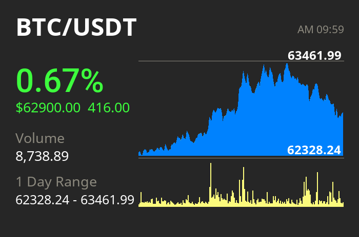

<p align="center">  
  
</p>

[](https://github.com/EddieKuo723/plot-crypto/actions/workflows/Update_Image.yml)

<h1 align="center">Plot Cryptocurrency</h1>

> 📈 Generate a real-time image displaying the chart of cryptocurrency prices.

## Introduction

This tool generates real-time price charts for major cryptocurrencies supported by Binance (e.g., BTC, ETH, LTC, SOL, etc.). The charts display a 24-hour summary, 5-minute interval kline graph (using a filled-polygon style), trading volume bars, and day range statistics.

## Caching

Caching is handled via HTTP response headers:
```http
Cache-Control: max-age=184, public
```

## Deployment

To deploy the application locally:
```bash
git clone https://github.com/EddieKuo723/plot-crypto.git
docker-compose up -d
```
Visit http://127.0.0.1:5001/, and enjoy it! ✅

<br />
<br />

### Request Parameters

You can specify the cryptocurrency symbol using the `type` parameter:
- **Bitcoin**: http://localhost:5001/plotBinance.php?type=BTC
- **Ethereum**: http://localhost:5001/plotBinance.php?type=ETH
- **Solana**: http://localhost:5001/plotBinance.php?type=SOL

## Built With
* [Binance API](https://github.com/binance/binance-spot-api-docs/blob/master/rest-api.md#klinecandlestick-data)
* [Docker Compose](https://docs.docker.com/compose/)
* [Roboto Fonts](https://fonts.google.com/specimen/Roboto)
* [PHP GD Library](https://www.php.net/manual/en/book.image.php)

## Author

**EddieKuo723** © [EddieKuo723](https://github.com/EddieKuo723), Released under the Apache License.<br>
