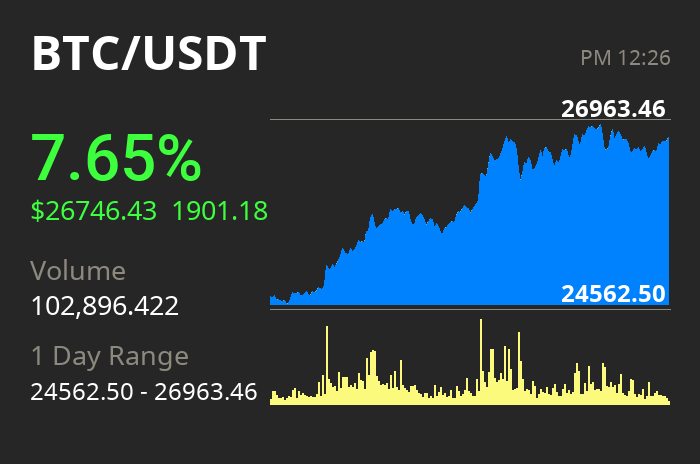

<h1 align="center">Plot Cryptocurrency</h1>
<p align="center">  
  
  > 📈 Plot realtime cryptocurrency price chart image
</p>


## Introduction
Support 7 cryptocurrencies 
 - BTC
 - ETH
 - LTC
 - XMR
 - ZEC
 - BCH
 - XRP

## Cache Configurations
`CACHE_SECS`: image cache expiry time in seconds, default to 60
```
FROM php:7.2-apache
COPY . /var/www/html/
WORKDIR /var/www/html/

EXPOSE 80
ENV CACHE_SECS=60
```

## Deployment
```
git clone https://github.com/EddieKuo723/plot-crypto.git
docker-compose up -d
```
Visit http://127.0.0.1:5000/, and enjoy it! ✅
<br /><br />
Set Requests Parameter for different coin
<br />
http://localhost:5000/plotCachePolo.php?coin=ETH

## Built With
* [Poloniex API](https://docs.poloniex.com/#returnchartdata)
* [Docker Compose](https://docs.docker.com/compose/)
* [Composer](https://getcomposer.org/)
* [predis](https://github.com/nrk/predis)
* [Roboto Fonts](https://fonts.google.com/specimen/Roboto)


## Author

**EddieKuo723** © [EddieKuo723](https://github.com/EddieKuo723), Released under the Apache License.<br>
